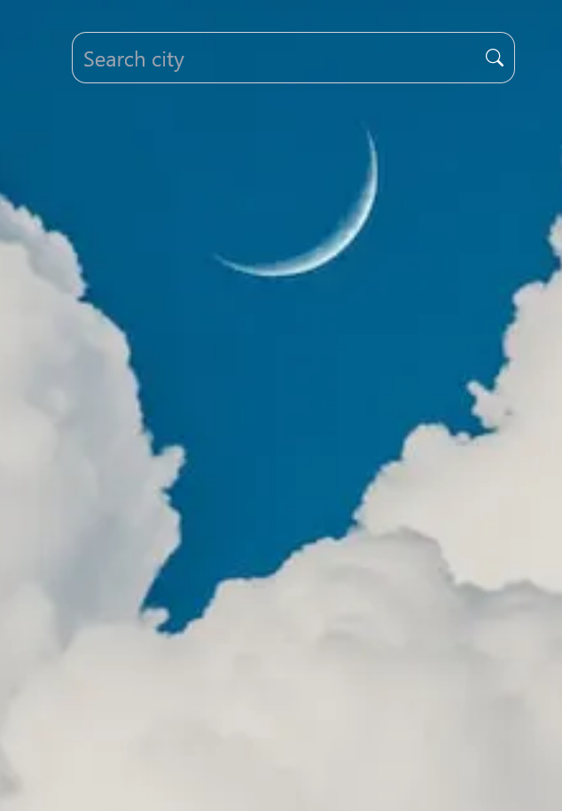
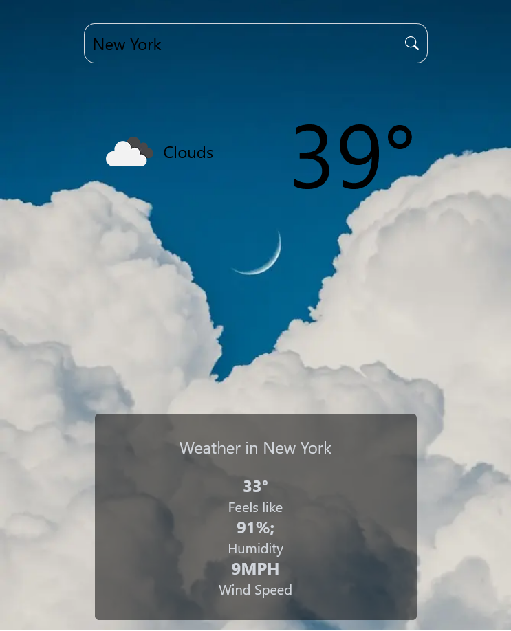

# Next Weather App

## Description
 Next Weather App is an Web Application that takes Advantages of the Open Weather Map API. Built on Next.js it uses TailwindCSS for styling and Vercel for deployment. Search any city in the USA to display the Tempeture the "Feels like Tempeture" as well as Humidity and wind speed.
## Technologies Used
- HTML5
- CSS3
- Axios
- JAVASCRIPT
- Open Weather API
- Next.js
- Git/Github 
- Vercel pages for Hosting

## Screenshots

## Getting Started
[Get Started here](https://next-weather-pp.vercel.app/)

